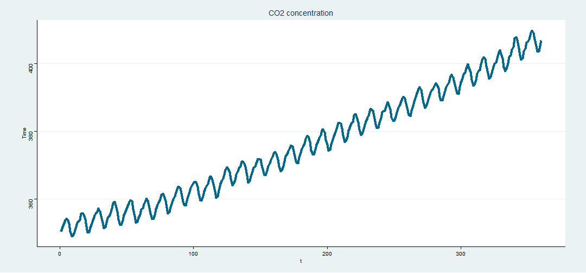

Describing CO2Hawaii dataset
========================================================
author: María Cristina Sánchez Iglesias
autosize: true

About CO2Hawaii dataset
========================================================

We are describing "CO2Hawaii" dataset from Stat2Data R package. 

This dataset contains information about monthly carbon dioxide readings at Mauna Loa, Hawaii from January 1988 to December 2017. 

The variables that compound "CO2Hawaii" dataset are:

- Year
- Month, with values from 1 to 12.
- CO2: Atmospheric carbon dioxide level in ppm
- t: Time interval, with values from 1 to 360 (the number of available values).

It has been collected from the ESRL/GMD data page at <https://www.esrl.noaa.gov/gmd/ccgg/trends/data.html>.

Slide With Code
========================================================


```r
library(Stat2Data)
data(CO2Hawaii)
data=CO2Hawaii
head(data)
```

```
  Year Month    CO2 t
1 1988     1 350.39 1
2 1988     2 351.64 2
3 1988     3 352.41 3
4 1988     4 353.69 4
5 1988     5 354.21 5
6 1988     6 353.72 6
```


Slide With Plot
========================================================



Concentration per year
========================================================

```r
library(plotly)
p <- plot_ly(data, x = ~t, y = ~CO2, name = 'CO2', type = 'scatter', mode = 'lines') 
htmlwidgets::saveWidget(p,'plotly.html')
```

<iframe frameborder="0" seamless='seamless' scrolling=no src="plotly.html"></iframe>

Averages by month
========================================================


```
processing file: index.Rpres
Loading required package: ggplot2
No renderer backend detected. gganimate will default to writing frames to separate files
Consider installing:
- the `gifski` package for gif output
- the `av` package for video output
and restarting the R session

Attaching package: 'plotly'

The following object is masked from 'package:ggplot2':

    last_plot

The following object is masked from 'package:stats':

    filter

The following object is masked from 'package:graphics':

    layout

Quitting from lines 56-68 (index.Rpres) 
Error: First argument, `data`, must be a data frame or shared data.
Además: Warning message:
package 'gganimate' was built under R version 4.0.4 
Ejecución interrumpida
```
